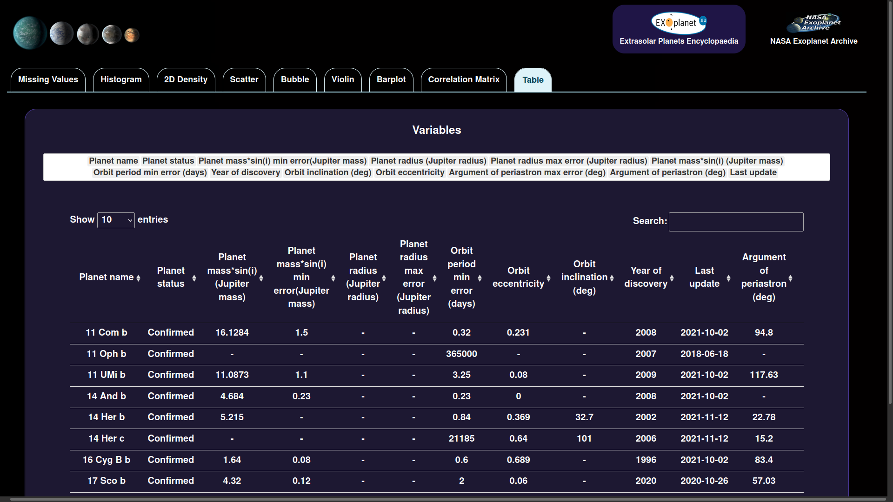

# Exoplanets Dashboard

https://rafael747cardoso.shinyapps.io/Exoplanets_Dashboard/

Exploratory analysis of the available data on all the confirmed and candidate exoplanets, acording to The Extrasolar
Planets Encyclopaedia and NASA Exoplanet Archive.

## Data sources

http://exoplanet.eu/

https://exoplanetarchive.ipac.caltech.edu/docs/data.html

## Figures:

